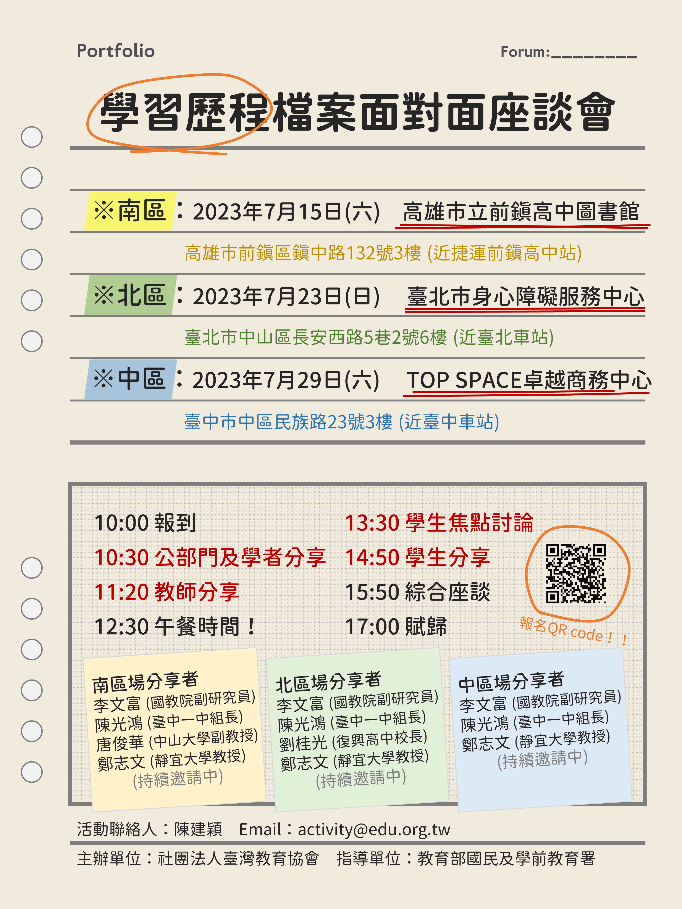

+++
author="陳建穎"
title="2023「學習歷程檔案面對面座談會」現正報名中！"
date="2023-05-22"
image="img/article/2023-portfolio-cover-photo.png"
description="活動資訊"
tags=["學習歷程檔案", "大學入學", "考招", "十二年國教", "教育改革", "座談會"]
+++

## 社團法人臺灣教育協會「學習歷程檔案面對面座談會簡章」

### 一、目的

增進公部門、學界、現場教師、學生及大學招生端各界，就學習歷程檔案議題之交流，提升理解與對話，並有效蒐整意見，作為政策制定調整參考。  

### 二、辦理單位

主辦單位：社團法人臺灣教育協會  
指導單位：教育部國民及學前教育署  

### 三、參加對象

公部門、學者、大學及高中教師。  
108 學年度起入學高級中等教育階段，適用學習歷程檔案，即現就讀高一至大一之學生。  
有意願之學生，得自北、中、南三區擇一場次報名，每場次各計 40 人。  

### 四、活動時間

南區：112 年 7 月 15 日（星期六）  
北區：112 年 7 月 23 日（星期日）  
中區：112 年 7 月 29 日（星期六）  

### 五、活動地點

南區：高雄市前鎮區鎮中路 132 號（高雄市立前鎮高級中學圖書館 3 樓）
北區：臺北市中山區長安西路 5 巷 2 號（臺北市身心障礙服務中心 6 樓）
中區：臺中市中區民族路 23 號 3 樓（近台中車站）

### 六、活動說明與內容

#### 公部門與學者分享

由國教署學習歷程檔案之相關主管人員、政策制定時諮詢之學者專家等闡述學習歷程檔案政策之制定過程、執行歷程及回顧階段性之推動成果。

#### 教師分享

由學習歷程檔案（種子）教師就教學現場之學習歷程檔案政策實踐過程經驗、影響及效益分享。  
由大學校院負責個人申請第二階段審查者，就高中選擇就讀大學相關科系應具備之特質、學習歷程檔案，對其審酌入學之影響及面對首次採用學習歷程檔案與過往，進行差異分享。

#### 學生焦點討論

引導學生共同參與討論，就其製作及使用學習歷程檔案之經驗、疑問及想法交流討論，以蒐整意見。

#### 綜合座談

以達到資訊交流為目的，綜合座談時間提供多元且平等之多方對話平台。

## 七、報名方式及須知

1. 報名日期：即日起至112年6月9日（星期五）。  
2. 有意願報名參與之學生，請至線上表單[連結](https://forms.gle/6VBT3TLvPQNAE4Er8)依限完成線上報名。  
3. 正備取名單將於 112 年 6 月 19 日（星期一）公告於本協會官方網站（[edu.org.tw](https://edu.org.tw)） ，並且依序以電子郵件方式通知正備取學生。  
4. 已報名之學生倘因故無法出席，應於活動一週前通知本協會，俾利通知備取學生等作業。
5. 本活動地點選擇因以交通便利為優先考量，爰請自行規劃參加交通工具。  
6. 居住於花東、離島及偏遠地區學生，須申請交通費用與住宿補助者，請於報名表單提出，主辦單位將與您聯繫確認。  
7. 有特殊需求需協助者（如需要手語、聽打或其他無障礙措施），請於報名表單提出，主辦單位將與您聯繫確認。另因中區廁所並不符合無障礙規範，倘有需求者，建議優先選擇北區或南區報名，因此產生的交通及住宿費用，得由主辦單位比照前款規定補助之，如造成困擾尚請見諒。  
8. 對活動報名及其他相關事項有疑問者，歡迎透過下列聯絡方式聯繫，建議優先以電子郵件聯絡，主辦單位將盡快回覆。  
9. 本計畫如有未盡事宜，得視實際執行情形隨時修正之。  
10. 本活動經費係由國教署經費補助辦理。  
11. 個人資料告知事項  
依據個人資料保護法（以下簡稱個資法）第八條第一項規定，本協會（社團法人臺灣教育協會）為辦理「學習歷程檔案面對面座談會」，需要蒐集您的姓名、就讀學校及年級、手機號碼等個人資料；如需自本會領受款項者，依會計法、所得稅法及相關主計規範等相關規定，另需蒐集您的身分證字號及戶籍地址等個人資料。該等個人資料並於本會執行本項計畫之期間，依法令及契約利用之，您得依據個資法第三條規定查詢或請求閱覽、製給複製本、補充或更正、停止蒐集、處理或利用及刪除，或您亦可選擇不提供相關個人資料，惟您如不願提供或請求停止蒐集、處理或利用及刪除，可能導致本會無法繼續為您安排座談會參與。如您欲行使上開權利，請以下列 Email 方式通知本協會。  

### 聯絡方式  

聯絡人：社團法人臺灣教育協會　陳建穎  
聯絡電話：02-25080218  
E-Mail：[activity@edu.org.tw](mailto:activity@edu.org.tw)（建議優先以電子郵件聯繫）

### 檔案下載

- [活動簡章](https://drive.google.com/file/d/1ZpbT52K8rzHdd-usBYc8ZG02d9CE1Bm5/view)

